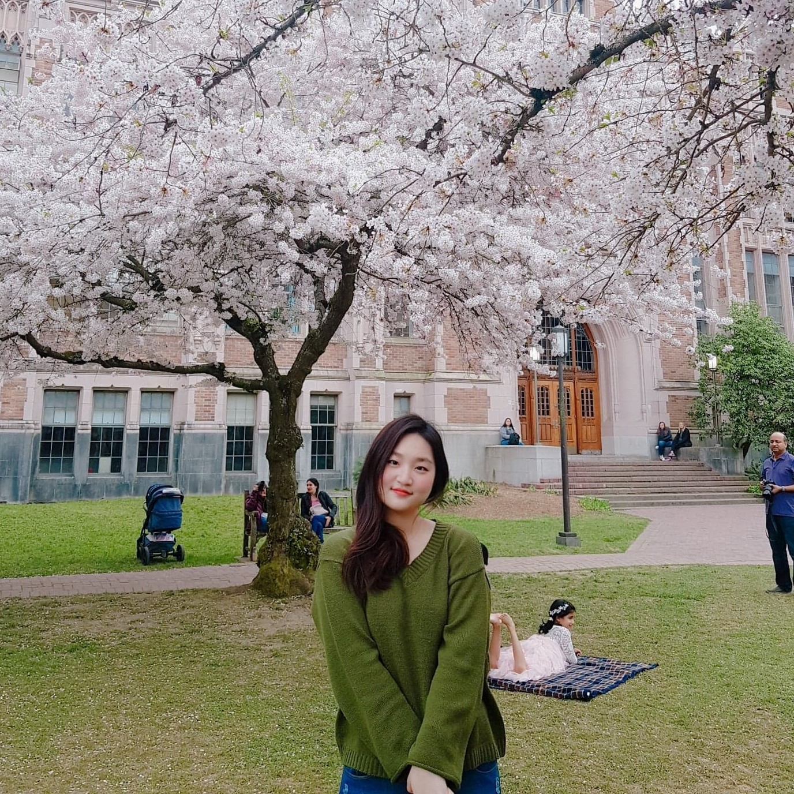

# Stella Joo

jooh2@uw.edu

Hello, my name is Stella Joo.
I am a fourth-year undergraduate majoring in *Geography: GIS, Mapping, and Society*
As a GIS-experienced geographer, I do mapping and analysis using geographical technologies.
I am interested in the digital Geographies that embrace Geogrphy and the digital society together.

This is my digital portfolio! [Scalar](https://scalar.usc.edu/works/digital-portfolio-7/users/32637)

## Education
> University of Washington (Seattle, WA)
  >> September 2016 - Present  
  >> Bachelor of Arts  
  >> Geography - GIS, Mapping, and Society Track

> Grace Baptist Academy (Baguio City, Philippines)
  >> June 2012 - March 2015  
  >> Valedictorian Graduate

## Work Experience
1. **Dining Student Assistant** (Seattle, Washington)
* Worked at different positions in the dining area of the University of Washington
* Accomplished to:
   * Communicate directly with the students and customers
   * Cooperate with many students from different backgrounds
2. **Assistant Officer** (Seoul, Korea)
* Managed administrative documents at the exchange student program headquarter
* Accomplished to:
   * Complete tasks efficiently to make the dates
   * Use English and Korean in preparing the program curriculum

## Skills
- Bilingual in English and Korean
- Eligible in Computer Tasks
- Experienced GIS Services - ArcGIS, QGIS
- Statistical Skills - R language, Tableau
